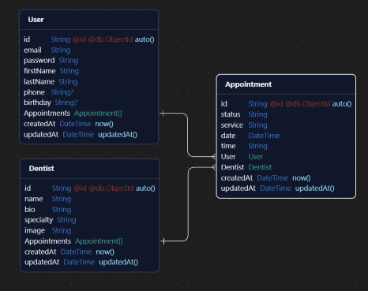

# Dental 24x7 - Backend API

Dental 24x7 is a Node.js-based backend service that provides RESTful API endpoints for managing online dental appointments. This system handles user authentication, appointment scheduling, and dentist management.

## Table of Contents

- [Features]()
- [Tech Stack]()
- [Folder Structure]()
- [Installation]()
- [API Endpoints]()
- [Database Schema]()
- [Error Handling]()
- [Security Measures]()
- [Deployment]()

## Features

- **User Authentication:** Patients can register, log in, and manage their profiles.
- **Appointment Management:** Users can book, reschedule, or cancel appointments.
- **Dentist Management:** View available dentists and their schedules.
- **Rate Limiting:** Prevents API abuse.

## Tech Stack

- **Backend:** Node.js, Express.js
- **Database:** MongoDB
- **ORM**: Prisma
- **Authentication:** JSON Web Tokens (JWT)
- **Security:** CORS, bcrypt.js

## Folder Structure

dental24x7_backend/
├── src/
│ ├── controllers/ # Route handlers
│ ├── middleware/ # Custom middleware
│ ├── routes/ # API routes
│ ├── prisma/ # Prisma schema and client
│ ├── utils/ # Helper functions
│ ├── types/ # TypeScript types
│ └── index.ts # Entry point
├── package.json
** └── tsconfig.json**

## Installation

To set up the backend locally, follow these steps:

1. **Clone the repository:**

   ```bash
   git clone https://github.com/SadPenguin24/dental24x7_backend.git
   ```

2. **Navigate to the backend directory:**

   ```bash
   cd dental24x7_backend
   ```

3. **Install dependencies:**

   ```bash
   npm install
   npx prisma generate
   ```

4. **Set up environment variables:**
   Create a `.env` file in the root directory and configure the following:

   ```env
   PORT=5000
   DATABASE_URL=your_database_url
   JWT_SECRET=your_secret_key
   ```

5. **Run the server:**

   ```bash
   npm run dev
   ```

   The API should now be running on `http://localhost:5000/`

## API Endpoints

| Method | Endpoint                     | Description                                  |
| ------ | ---------------------------- | -------------------------------------------- |
| POST   | /api/auth/register           | Register a new user                          |
| POST   | /api/auth/login              | Log in and receive a JWT                     |
| GET    | /api/auth/profile            | Retrieve Profile by User Token               |
| GET    | /api/dentists                | Retrieve available dentists                  |
| GET    | /api/dentist/:id             | Retrieve a dentist via id                    |
| POST   | /api/dentist/create          | Create a Dentist (Backend Only)              |
| POST   | /api/appointments/create     | Book a new appointment                       |
| Patch  | /api/appointments/update/:id | Update an appointment (Reschedule or Cancel) |
| GET    | /api/appointments/:id        | Retrieve an Appointment                      |

## Database Schema

- **Users Table:** Stores patient data.
- **Dentists Table:** Contains information on available dentists.
- **Appointments Table:** Tracks appointment details of the user and dentist.



## Error Handling

- Uses Express middleware to handle errors gracefully.
- Returns standardized error messages and status codes.

## Deployment

- **GitHub:** Git Version Control
- **Render:** Deployment Platform

## Security Measures

- **JWT Authentication:** Secure user sessions.
- **Rate Limiting:** Protects API from excessive requests.
- **CORS Policies:** Controls API access.
